<div align="center">
  
</div>


<div align="center">
  
  
  
</div>

<br>

<div align="center">
  
  ```
  💡 Currently Active • 🚀 Working on cross-platform apps and AI tools
  📚 Learning Android development • ☕ Probably debugging
  ```
  
</div>

---

## 🧑‍💻 About Me


```typescript
const hira = {
    location: "Islamabad, Pakistan",
    education: "Computer Science @ NUST",
    currentFocus: ["Cross-platform apps", "AI tools", "UI/UX"],
    hobbies: ["Building cool stuff", "Teaching/Mentoring", "Event organizing"],
    funFact: "I might be refactoring code or decorating a campus event—no in-between!"
};
```

- 🔭 Building **cross-platform apps**, **AI tools**, and anything that makes life easier (or more fun!)
- 🎓 I love **simplifying complex ideas**—through clean code or one-on-one tutoring sessions  
- 🌱 Always exploring the intersection of **design**, **development**, and **impact**
- 👥 Mentored **20+ students** and built **15+ projects**
- ⚡ **Fun fact**: I debug mostly my own brain 🧠

---

## 🛠️ Tech Stack

<div align="center">

### Languages


### Frameworks & Tools


### Soft Skills


</div>

---

## 📊 GitHub Stats

<div align="center">
  
  
</div>

<div align="center">
  
</div>

<div align="center">
  
</div>

---

## 🚀 Projects I'm Proud Of

<table>
<tr>
<td width="50%">

### 🧠 Pact AI
*Mental wellness app with AI-powered journaling*

**Tech Stack:** `Flutter` `Claude API` `Firebase`

A comprehensive mental health companion featuring AI-powered journaling and chat support to help users track and improve their mental wellness journey.

⭐ **24 stars** • 🔗 [View Project](#)

</td>
<td width="50%">

### 🍽️ Satiate
*Food donation platform with real-time tracking*

**Tech Stack:** `MongoDB` `Express` `React` `Node.js`

Platform connecting food donors with NGOs, featuring real-time inventory tracking to reduce food waste and help those in need.

⭐ **18 stars** • 🔗 [View Project](#)

</td>
</tr>
<tr>
<td width="50%">

### 👋 Hand Maestro
*Gesture-controlled media player*

**Tech Stack:** `Python` `OpenCV` `MediaPipe`

Hands-free media control using computer vision and gesture recognition, perfect for presentations and accessibility needs.

⭐ **31 stars** • 🔗 [View Project](#)

</td>
<td width="50%">

### 🚫 BlockedAI
*AI-powered focus extension*

**Tech Stack:** `JavaScript` `Chrome API` `AI`

Chrome extension that politely tells distractions to go away, helping users maintain focus with AI-powered intervention.

⭐ **12 stars** • 🔗 [View Project](#)

</td>
</tr>
</table>

---

## 🎓 Learning Goals

```mermaid
graph LR
    A[🎯 Current Goals] --> B[📱 Android Development]
    A --> C[🤖 Ethical AI & ML]
    A --> D[🎨 Intuitive UI Design]
    
    B --> E[Meta Professional Cert]
    C --> F[Real-world Applications]
    D --> G[User-Friendly Interfaces]
    
    style A fill:#6366f1,stroke:#4f46e5,color:#fff
    style B fill:#10b981,stroke:#059669,color:#fff
    style C fill:#f59e0b,stroke:#d97706,color:#fff
    style D fill:#ec4899,stroke:#db2777,color:#fff
```



- 📱 **Building Android apps like a pro** (via Meta's Professional Certificate)
- 🤖 **Practicing ethical AI** and real-world ML applications  
- 🎨 **Designing intuitive UIs** that don't make users cry
- 🌐 **Full-stack development** with modern frameworks
- 📊 **Data visualization** and analytics

---

## 🏆 Achievements & Highlights

<div align="center">

| 🎯 Metric | 📊 Value |
|-----------|----------|
| **Projects Built** | 15+ |
| **Students Mentored** | 20+ |
| **GitHub Contributions** | 500+ |
| **Cups of Coffee** | ∞ |

</div>

<div align="center">
  
</div>

---

## 📈 Contribution Activity

<!--START_SECTION:activity-->
- 🔥 Recent activity will be displayed here automatically
- 📝 Latest commits and contributions
- 🚀 Project updates and releases
<!--END_SECTION:activity-->

<div align="center">
  
</div>

---

## 🤝 Let's Connect!

<div align="center">

[](mailto:hirasajid.dev@gmail.com)
[](https://linkedin.com/in/hsajid-cs)
[](https://github.com/hsajid-cs)

</div>

<div align="center">
  
  ### 💭 *"I build, I teach, I debug (mostly my own brain). Thanks for dropping by!"*
  
  
  
</div>

---

<div align="center">
  
  
</div>
